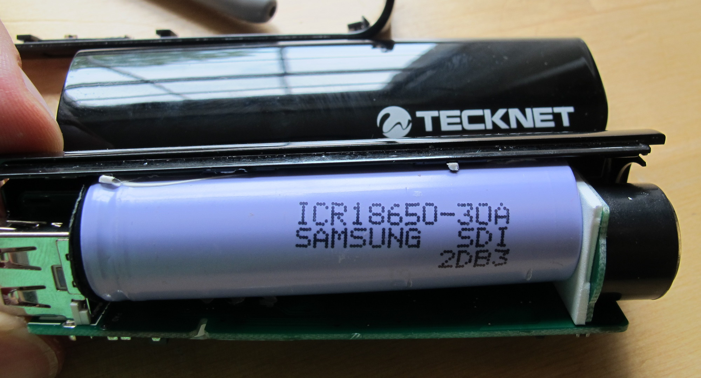

# Tecknet iep300 power bank

## Introduction

The [tecknet iep300](http://www.amazon.co.uk/Ultra-Compact-Lipstick-Sized-Flashlight-Lightning-Blackberry/dp/B001HG1ZFK) is based on a Li-Ion 18650 battery and stated to deliver 3000mAh. 

The 18650 format seems to be highly susceptible to fraud. Some good examples are [documented here](http://www.torchythebatteryboy.com/p/18650-batteries-chargers.html). 

We needed to be sure that the battery pack would work well to power a Raspberry Pi model B computer for at least 2 hours. As well as checking that the power pack worked for this time, we opened the case and checked the battery model. 

The printing on the battery is a Samsung icr18650-30a. However, it is easy to fake a printed label, so we also did a battery discharge test.

We also checked the charge profile, and the low voltage protection cut out voltage.

## Conclusion

The battery pack (for now) uses a high quality Li-Ion battery. It delivers at least 2500mAh which equates to 5 hours runtime for a Raspberry Pi model B.

The low voltage drop out is perhaps slightly low at 2.5v, and our discharge test was ended at 3v. So you could get longer run times but possibly cause faster battery degradation in the longer term.

# Measurements

##Raspberry Pi model b current test

* Desolder battery from circuit,
* Measure current drawn when powering Raspberry Pi model b (no peripherals).

result = 500mA.

##Battery discharge test

* Battery is out of circuit with charger,
* Low voltage cut off set to 3v,
* Current drawn set to 500mA.

[battery data csv](battery.csv)

## Charge current

* from flat (3v) 0.6A,
* dropping to 0.4A when batt is at 4v,
* 0.2A at 4.15v,
* takes 2 hours to fully charge.

## Cutoff voltage

Regulates to 5v (with load connected) down to 2.5v then cuts off. 

# References

##Battery

Battery is a samsung [icr18650-30a](http://www.fasttech.com/product/1314901-authentic-samsung-icr18650-30a-18650-4-35v)

##Similiar battery review

[Samsumg 2800](http://www.torchythebatteryboy.com/p/18650-batteries-chargers.html)

##Low voltage of Li-Ion

[3v on the candle power forums](http://www.candlepowerforums.com/vb/showthread.php?212790-Li-ion-Reasonable-low-voltage-cutoff)
[3.2v from wikipedia](http://en.wikipedia.org/wiki/Cutoff_voltage)

