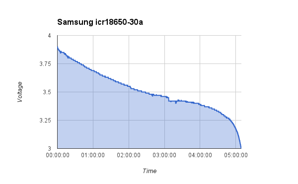

# Tecknet iep300 power bank

The [tecknet iep300](http://www.amazon.co.uk/Ultra-Compact-Lipstick-Sized-Flashlight-Lightning-Blackberry/dp/B001HG1ZFK) is based on a Li-Ion 18650 battery and stated to deliver 3000mAh. 

The 18650 format seems to be highly susceptible to fraud. Some good examples are [documented here](http://www.torchythebatteryboy.com/p/18650-batteries-chargers.html). 

We needed to be sure that the battery pack would work well to power a Raspberry Pi model B computer for at least 2 hours. As well as checking that the power pack worked for this time, we opened the case and checked the battery model. 

The printing on the battery is a Samsung icr18650-30a. However, it is easy to fake a printed label, so we also did a battery discharge test.

We also checked the charge profile, and the low voltage protection cut out voltage.

## Measurements

#Battery discharge test

* battery is out of circuit with charger
* set low voltage to 3v, current to 0.5A
* run time test.

[battery data csv](battery.csv)

# Charge current

* from flat (3v) 0.6A
* dropping to 0.4A when batt is at 4v
* 0.2A at 4.15v

# Cutoff voltage

Regulates to 5v (with load connected) down to 2.5v then cuts off.
2.5v seems low for a Li-Ion.

#Raspberry Pi model b current test

* desolder battery from circuit
* measure current drawn when powering model b (no peripherals)

result = 0.5A

# References

##Battery

Battery is a samsung [icr18650-30a](http://www.fasttech.com/product/1314901-authentic-samsung-icr18650-30a-18650-4-35v)

##Similiar battery review

[Samsumg 2800](http://www.torchythebatteryboy.com/p/18650-batteries-chargers.html)

##Low voltage of Li-Ion

[3v on the candle power forums](http://www.candlepowerforums.com/vb/showthread.php?212790-Li-ion-Reasonable-low-voltage-cutoff)
[3.2v from wikipedia](http://en.wikipedia.org/wiki/Cutoff_voltage)

